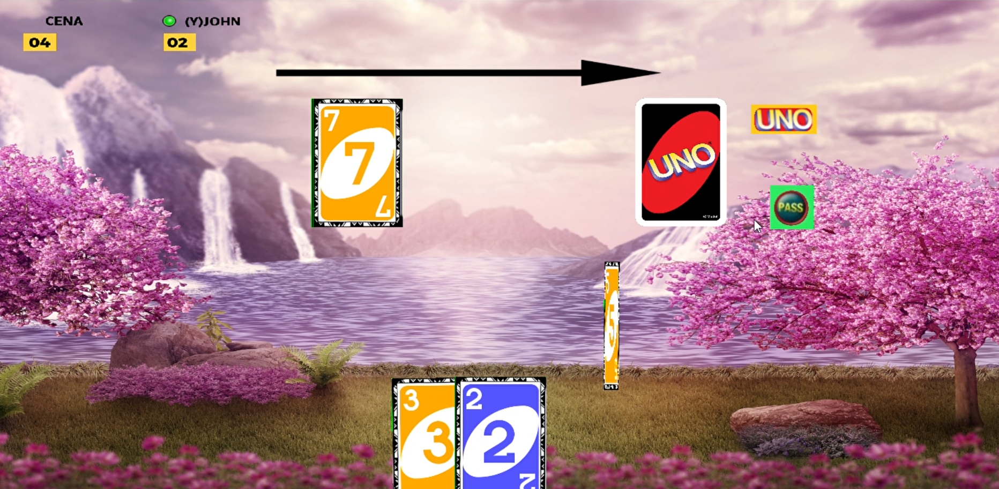

# Multiplayer UNO

A multiplayer implementation of the classic game of UNO.
I couldn't find any online UNO game supporting more than 4 players,
so I made it during the Covid Lockdown using Godot Engine.

One of the players should press "host", while the other players
should type in the ip address of the host and press "join".
The host must enabling port forwarding in his/her router.
Alternatively, the host can use a combination of OpenVPN Connect
and a service like portmap.io

This game seeks out to implement all aspects of the UNO game,
like Draw cards, Wild cards, penalties for not declaring UNO.

Communication and syncronization happens using Remote Procedure Calls.

Language: GDScript

## Screenshots

